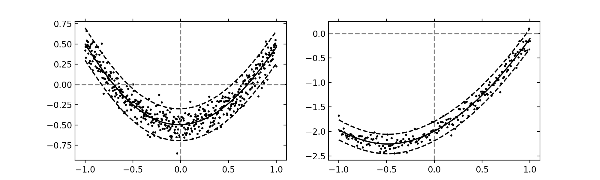

### Gaussian processes

Last update: January 2020.

---

Lightweight Python library implementing Gaussian processes for regression [1].

```
pip3 install gp-lib
```

A Gaussian process specifies a collection of jointly Gaussian random variables specified by a mean (which below we assume to be zero) and covariance function between two data points.

<p align="center"></p>

Predictions are made by conditioning on a subset of variables.

<p align="center"></p>

#### Explicit basis functions

One unique aspect of our code is it provides out-of-the-box support for GPs with *explicit basis functions*, and the corresponding closed form solutions described in Chapter 2.7 of [1]. 

Specifically, we model a GP with mean given by , where  is a parameter with normal prior. It can be particularly useful to specify basis functions  with representations learned from deep neural networks [2].
<p align="center"></p>
Note that this is equivalent to the following GP. However, for issues of numerical stability it is recommended to use the explicit closed form solutions that we provide instead of naively implementing the below.
<p align="center"></p>
Often times the mean parameter itself will be of interest. After a set of observations, its posterior distribution will be normally distributed (thanks to conjugacy of the normal distribution) with the following parameters.
<p align="center"></p>
Below we show an example of fitting to a linear relationship with quadratic residuals.

```python
import numpy as np
from gp_lib.gp import StochasticMeanGP
from gp_lib.kernels import SEKernel

# generate some data
x = np.linspace(-1, 1, 500)[:, np.newaxis]
h = np.linspace(-1, 1, 500)[:, np.newaxis]
y = (x ** 2 + h + 0.1 * np.random.randn(*x.shape) -2).squeeze()
h = np.c_[h, np.ones_like(h)]

# zero-mean, vague prior 
kernel = SEKernel(1, 1)
gp = StochasticMeanGP(prior_mean=np.array([0, 0]), 
                      prior_var=5 * np.eye(2), kernel=kernel, 
                      noise_lvl=0.01)

# fit and make predictions
marginal_loglik = gp.fit(x, y, h)
mean, var = gp.predict(x, y)
beta_mean, beta_var = gp.get_beta()
```

This results in the following posterior estimate.
<p align="center"></p>

#### Supported kernels

For now we have the SE kernel and dot product kernel.
<p align="center"></p>
Hyper-parameters can be tuned via gradient ascent on the marginal log-likelihood, or cross-validation on the marginal log-likelihood.

**Sparse GPs**

We support variational learning of sparse GPs [4].

#### Optimal sensor placement

We implement as well a greedy selection algorithm for near-optimal sensor placement with Gaussian processes [3]. The intuition is that we want to pick a set of fixed size to maximize the *mutual information* between selected data points and non-selected data points.
<p align="center"></p>
This process is approximated in a greedy manner, picking out the next data point that maximizes mutual information between the selection and all remaining items.

#### Usage

The above examples results in the following prediction intervals.



For further details the `examples/` folder.

#### References

[1] Carl Edward Rasmussen and Christopher K. I. Williams. 2005. Gaussian Processes for Machine Learning (Adaptive Computation and Machine Learning). The MIT Press.

[2] Jiaxuan You, Xiaocheng Li, Melvin Low, David Lobell, Stefano Ermon. Deep Gaussian Process for Crop Yield Prediction Based on Remote Sensing Data. in *Thirty-First AAAI Conference on Artificial Intelligence* (2017).

[3] Andreas Krause, Ajit Singh, and Carlos Guestrin. 2008. Near-Optimal Sensor Placements in Gaussian Processes: Theory, Efficient Algorithms and Empirical Studies. J. Mach. Learn. Res. 9 (June 2008), 235-284.

[4] Titsias, M. (2009). Variational Learning of Inducing Variables in Sparse Gaussian Processes. In International Conference on Artificial Intelligence and Statistics, pp. 567–574.

#### License

This library is available under the MIT License.
